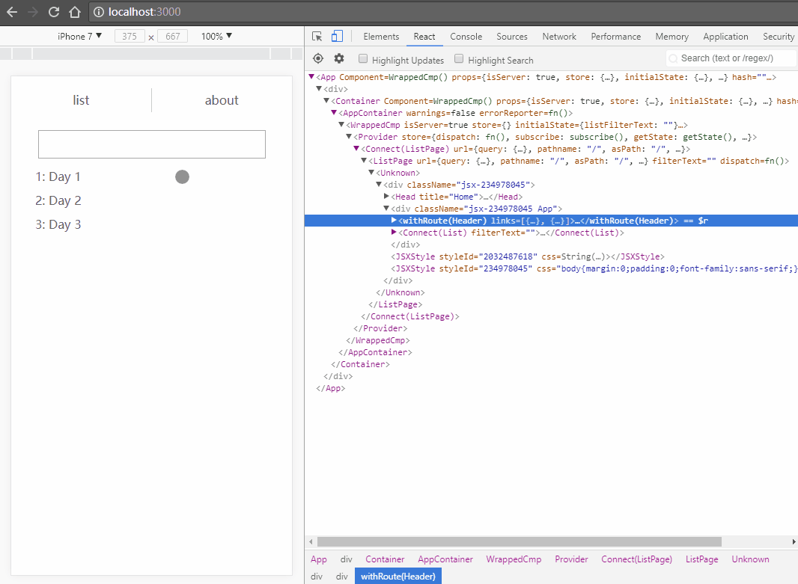

# react-ssr

模板项目，用于快速开始使用React和Next开发建站。

## 架构特性

单/多页面应用，服务器端渲染页面组件、控制路由。使用react、redux、next。

## 构建和启动命令

``` bash
# install dependencies
$ npm install

# serve with hot reload at localhost:3000
$ npm run dev

# build for production and launch server
$ npm run build
$ npm start
```

## 快速开发

可参考示例代码进行组件、路由、状态数据的快速开发。

